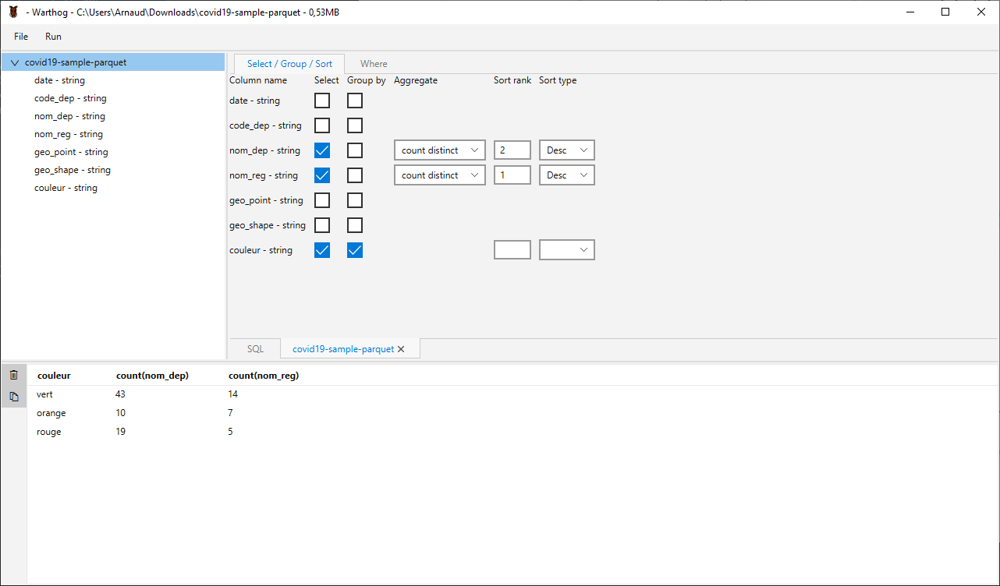
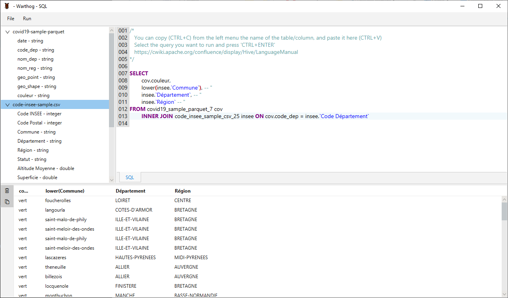
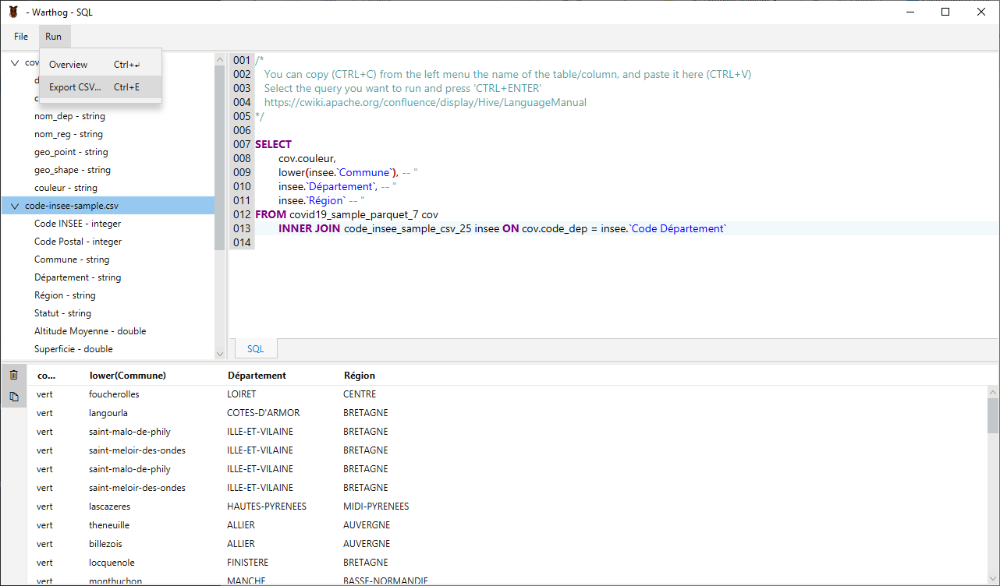

# WARTHOG

Warthog helps you to explore parquet, json and csv files. 
You can use the visual query builder, or the Hive SQL worksheet for more complex queries.  

## Main Features

* Simple query builder

A visual interface to build queries on a single file. 
You can easily select, aggregate, apply where clauses and sort your results.

* Hive SQL worksheet

For more flexibility, you can build your own SQL queries with the Hive SQL worksheet. 
Here you can use all the features of the SQL (Hive) language - manual is available here : https://cwiki.apache.org/confluence/display/Hive/LanguageManual

* Quick result overview / Export full result as csv file

To quickly visualize the first rows of your query ('Run -> Overview') 
or to export all the lines in a csv file ('Run' -> 'Export CSV...')

## Quick start

* Import Parquet in your session

# Environment :
- Java 11 (https://adoptopenjdk.net/releases.html)
- JavaFX 11.0.2 (https://gluonhq.com/products/javafx/)
- Spark 3.0.1
- Spring-boot 2.3.0.RELEASE
- Maven 
